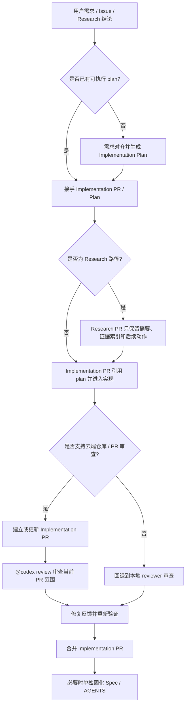

# Agent 工作流规范

## 定位

本项目采用 PR-first agent 工作流。GitHub PR 是任务执行、上下文承载、审查和追踪的主要单元。

本文件用于给不能直接使用本地 harness skill 的 agent 提供最小桥接协议。具体运行时步骤以相关 `AGENTS.md`、PR 模板和审查评论模板为准。



## 事实来源

| 内容 | 事实来源 |
|---|---|
| 工程硬约束 | 根级和相关子目录 `AGENTS.md` |
| 当前 agent 工作流 | `docs/specs/agent-workflow.md` |
| 单次任务上下文 | PR 描述和 PR 评论 |
| 研究结论 | Research PR 描述、评论和 `docs/prs/` 研究报告；不作为长期规范 |
| 代码变更 | implementation PR |

## PR 类型

### Research PR

Research PR 是临时研究容器。

规则：

- 使用 `.github/PULL_REQUEST_TEMPLATE/research.md`。
- 不修改业务代码。
- 不合并到 `main`。
- 不在 Research PR 分支上做实现开发。
- 研究结论写在 PR 描述、评论和 `docs/prs/` 研究报告里。
- 后续 implementation PR 可以引用 research PR。

### Implementation PR

Implementation PR 是真实变更单元。

规则：

- 使用 `.github/PULL_REQUEST_TEMPLATE/implementation.md`。
- 必须引用 `docs/harness/plans/YYYY-MM-DD-<slug>-plan.md`。
- 如果来自 research PR，必须引用对应 PR。
- 创建或更新后，按 `.github/codex-review-comment.md` 准备审查评论。

### Spec PR

Spec PR 只用于更新稳定规范。

规则：

- 只在同类问题重复出现，或某条流程稳定且影响后续 agent 时创建。
- 不和业务实现混在一起。
- 优先更新相关 `AGENTS.md` 或 `docs/specs/*.md`。

## 标准流程

```text
Notion 高层目标
  -> 主 agent 判断任务类型
  -> research PR 或 implementation PR
  -> Codex review
  -> 修复反馈
  -> 用户或主 agent 合并 implementation PR
  -> 必要时单独 spec PR 固化稳定规范
```

## 审查评论

- 模板：`.github/codex-review-comment.md`。
- 必须包含明确 `<base_sha>..<head_sha>`。
- 评论发送前只要带有了@codex review前缀且满足模版需求则无需展示给用户并取得批准。
- research PR 如需审查，仍使用同一模板，并在背景或补充信息中明确研究性质和审查重点。
- implementation PR 聚焦实际 diff 和非目标边界。


## 维护边界

- 不为临时发现建立长期文档。
- 不把 Research PR 或 `docs/prs/` 研究报告视作长期规范，除非已经通过独立 Spec PR 固化。
- 不让 workflow 文档数量膨胀；优先保持本文件短、准、可执行。
